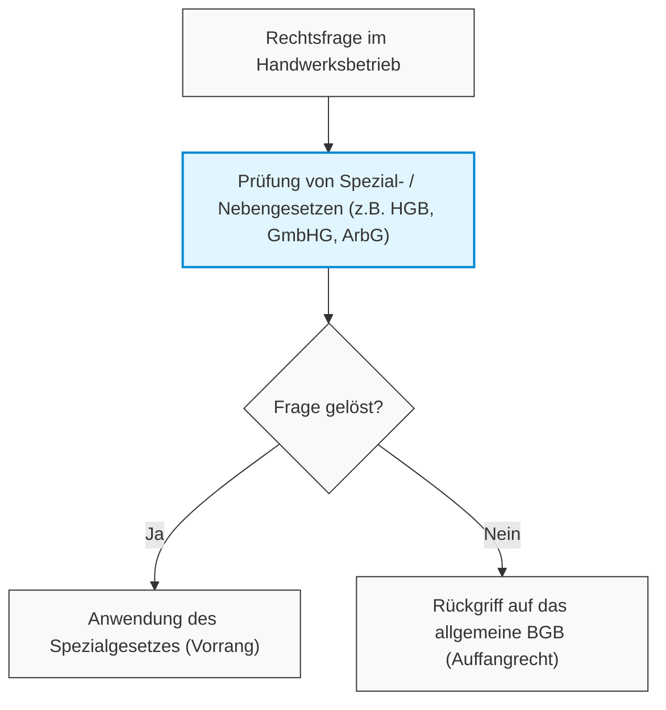

# 8.1.2 Systematik des Bürgerlichen Gesetzbuches

Das **Bürgerliche Gesetzbuch (BGB)** regelt die wichtigsten Gebiete des Privatrechts. Es ist systematisch aufgebaut und in fünf Bücher gegliedert.

## Die fünf Bücher des BGB

1. **Allgemeiner Teil (Buch 1):**
   - Enthält grundlegende Rechtsbegriffe, die für das gesamte BGB gelten (z. B. Definition von Unternehmer, Verbraucher, Personen, Rechtsgeschäften und Fristen).
2. **Recht der Schuldverhältnisse / Schuldrecht (Buch 2):**
   - Regelt die Beziehungen zwischen Gläubiger und Schuldner sowie die Entstehung und Abwicklung von Verträgen (z. B. Kaufvertrag, Werkvertrag, Mietvertrag) und gesetzlichen Schuldverhältnissen (z. B. Schadenersatz wegen unerlaubter Handlung).
3. **Sachenrecht (Buch 3):**
   - Regelt die rechtlichen Beziehungen von Personen zu Sachen (Besitz, Eigentum, Eigentumsvorbehalt, Grundpfandrechte wie Grundschuld und Hypothek).
4. **Familienrecht (Buch 4):**
   - Regelt die Beziehungen zwischen durch Ehe, Lebenspartnerschaft, Verwandtschaft und Schwägerschaft verbundenen Personen (z. B. Vertretung des Betriebsinhabers durch den Ehegatten).
5. **Erbrecht (Buch 5):**
   - Regelt die Rechtsfolgen beim Tod eines Menschen (z. B. gesetzliche Erbfolge, Testamente, Erbverträge für die Unternehmensnachfolge).

## Nebengesetze und Spezialgesetze
Neben dem BGB gibt es spezielle Regelungswerke für bestimmte Lebens- oder Wirtschaftsbereiche:
- **Handelsgesetzbuch (HGB):** Enthält Sonderregeln für Kaufleute (Handelsgewerbetreibende).
- **Arbeitsgesetze:** Regeln die Beziehungen zwischen Arbeitgeber und Arbeitnehmer.
- **Gesellschaftsgesetze:** Z. B. GmbHG (GmbH-Gesetz), AktG (Aktiengesetz).

### Rangfolge der Gesetze (Spezialitätsprinzip)
> [!IMPORTANT] Grundsatz
> **Spezialgesetze und Nebengesetze haben Vorrang vor allgemeinen Gesetzen** (*Lex specialis derogat legi generali*).
> 
> Das bedeutet: Im Wirtschaftsleben gelten vorrangig das HGB oder gesellschaftsrechtliche Spezialgesetze. Lässt sich eine Rechtsfrage damit nicht lösen, wird ergänzend auf das BGB (als allgemeines Auffangrecht) zurückgegriffen.

---
*Verknüpfung:* [[Band_2_Index]] | [[8_Rechtsvorschriften_Uebersicht]] | [[8_1_1_Privates_Oeffentliches_Recht]]
