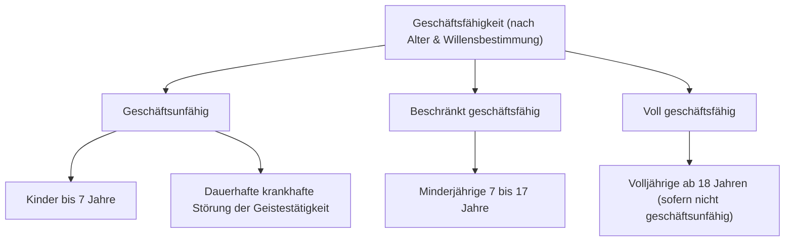

# 8.2.1 Rechts-, Geschäfts- und Deliktsfähigkeit

Es gibt die **Rechtsfähigkeit** und die **Handlungsfähigkeit**. Geschäfts- und Deliktsfähigkeit sind Teile der Handlungsfähigkeit.

---

## a) Rechtsfähigkeit

**Definition:** Rechtsfähigkeit ist die Fähigkeit, Träger von Rechten und Pflichten zu sein.

### Wer ist rechtsfähig?

| Art | Beispiele |
|---|---|
| **Natürliche Personen** | Alle Menschen |
| **Juristische Personen des Privatrechts** | AG, GmbH, eingetragener Verein (e. V.), Stiftung |
| **Juristische Personen des öffentlichen Rechts** | Gemeinden, Länder, Bund, Handwerkskammer, IHK, Innungen |
| **Personengesellschaften** | Mit Einschränkungen (z. B. GbR, OHG) |
| **Nicht rechtsfähig** | Sachen, Tiere |

### Beginn und Ende der Rechtsfähigkeit
- **Natürliche Personen:** von der **Geburt** bis zum **Tod**
- **Juristische Personen:** von der **Gründung** (z. B. Eintragung der GmbH im Handelsregister) bis zur **Auflösung** (z. B. Löschung aus dem Register)

---

## b) Geschäftsfähigkeit

**Definition:** Geschäftsfähigkeit ist die Fähigkeit, sich durch Rechtsgeschäfte (Verträge, Willenserklärungen) **rechtswirksam verpflichten** zu können.

### Die drei Stufen der Geschäftsfähigkeit

---

### 1. Geschäftsunfähige (§ 104 BGB)
- Kinder bis zur Vollendung des **7. Lebensjahres**
- Personen mit dauerhafter krankhafter Störung der Geistestätigkeit
- **Rechtsfolge:** Ein mit einem Geschäftsunfähigen abgeschlossenes Rechtsgeschäft ist **nichtig** (von Anfang an unwirksam).
- Für sie handelt ein **gesetzlicher Vertreter** (Eltern, Betreuer).

> [!NOTE] Betreuung Volljähriger
> Volljährige, die aufgrund körperlicher, geistiger oder seelischer Krankheiten/Behinderungen ihre Angelegenheiten nicht selbst besorgen können, erhalten einen gerichtlich bestellten **Betreuer**.

---

### 2. Beschränkt Geschäftsfähige (§§ 106–113 BGB)
- Minderjährige zwischen dem **vollendeten 7. und vollendeten 18. Lebensjahr**
- Gesetzliche Vertreter: die **Eltern** (bei ehelichen Kindern), bei nichtehelichen Kindern grundsätzlich die **Mutter**

#### Rechtsfolgen bei Rechtsgeschäften:
- Rechtsgeschäfte sind grundsätzlich nur wirksam, wenn der gesetzliche Vertreter **zustimmt**:
  - **Vorherige Zustimmung = Einwilligung**
  - **Nachträgliche Zustimmung = Genehmigung**
- Verweigert der Vertreter die Zustimmung → Rechtsgeschäft ist **unwirksam**.
- Äußert sich der Vertreter nach Aufforderung innerhalb von **14 Tagen nicht** → gilt als **Ablehnung** → Rechtsgeschäft kommt nicht zustande.

> **Beispiel:** Eine 17-Jährige kauft ohne Wissen der Eltern ein Smartphone. Der Kauf ist nur wirksam, wenn die Eltern nachträglich genehmigen. Verweigern sie es, muss der Händler das Smartphone zurücknehmen und kann keine Zahlung verlangen.

#### Ausnahmen – Ohne Zustimmung wirksame Rechtsgeschäfte:

| Ausnahme | Voraussetzung | Beispiel |
|---|---|---|
| **Taschengeldgeschäfte** | Mittel wurden vom Vertreter zur freien Verfügung überlassen; Barkauf (kein Kauf auf Raten!) | Kauf eines Rucksacks mit Taschengeld |
| **Vorteilhafte Rechtsgeschäfte** | Minderjähriger erlangt nur rechtlichen Vorteil, keine Verpflichtungen | Annahme eines Geldgeschenks |
| **Genehmigte Ausbildungsverhältnisse** | Eltern haben dem Ausbildungsvertrag zugestimmt | Minderjähriger Lehrling kann Vergütung annehmen und kündigen |

---

### 3. Voll Geschäftsfähige
- Alle **volljährigen Personen** (ab Vollendung des **18. Lebensjahres**)
- Ausnahme: Befinden sich dauerhaft in einem die freie Willensbestimmung ausschließenden Zustand (→ dann: Geschäftsunfähigkeit)

---

## c) Deliktsfähigkeit

**Definition:** Im Privatrecht die Verantwortlichkeit für Schäden, die man einem anderen zufügt (Haftung für unerlaubte Handlungen).

| Personengruppe | Deliktsfähigkeit |
|---|---|
| Kinder **unter 7 Jahren** | Nicht deliktsfähig (keine Haftung) |
| Kinder **7 bis unter 10 Jahren** | Bei Unfällen mit Kfz, Schienenbahnen oder Schwebebahnen: Haftung nur bei **Vorsatz** |
| Kinder/Jugendliche **7 bis unter 18 Jahren** | Haftung, wenn sie die zur Erkenntnis der Verantwortlichkeit erforderliche **Einsicht** hatten |
| **Volljährige** | Voll deliktsfähig (Ausnahme: bei Bewusstlosigkeit oder krankhafter Störung der Geistestätigkeit) |

---
*Verknüpfung:* [[Band_2_Index]] | [[8_Rechtsvorschriften_Uebersicht]] | [[8_2_2_Rechtsgeschaeftliches_Handeln|8.2.2 Willenserklärungen & Vertretung]]
