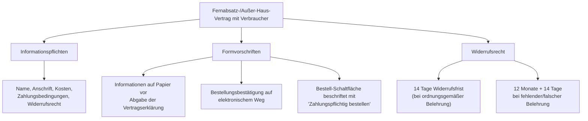

# 8.3.1.e Fernabsatz- und außerhalb von Geschäftsräumen geschlossene Verträge

## Erfasste Vertragsarten
Diese besonderen Regelungen gelten für Verträge mit **Verbrauchern** (nicht Gewerbekunden):
- Kaufverträge
- Werkverträge (insbesondere im Handwerk)

---

## Was ist ein Fernabsatzvertrag?

Ein Fernabsatzvertrag liegt vor, wenn bei den Vertragsverhandlungen und dem Vertragsschluss **ausschließlich Fernkommunikationsmittel** verwendet werden:

> Briefe | Telefonate | Telefax | E-Mails | Messenger-Chatverläufe | **Onlineshops**

## Was ist ein außerhalb von Geschäftsräumen geschlossener Vertrag?

Der Vertrag wird z. B. bei Beauftragung des Betriebs durch den Verbraucher **in dessen Wohnung** geschlossen.

---

## Besondere Pflichten (gegenüber herkömmlichen Verträgen)

---

## Widerrufsrecht im Detail

### Beginn der 14-Tages-Frist

| Vertragsart | Beginn der Widerrufsfrist |
|---|---|
| **Kaufvertrag** | Mit **Lieferung** der Ware an den Verbraucher |
| **Werkvertrag** | Mit **Vertragsschluss** |

### Fehlerhafte oder fehlende Belehrung
Wird der Verbraucher nicht oder falsch über sein Widerrufsrecht belehrt, verlängert sich die Frist auf:

$$14 \text{ Tage} \rightarrow 12 \text{ Monate} + 14 \text{ Tage}$$

### Rechtsfolgen bei Widerruf / Pflichtverletzungen
- Kein Wert- und Nutzungsersatz (grundsätzlich)
- Keine vereinbarten Versand-/Lieferkosten
- Schadensersatz möglich
- **Abmahnrisiko** für den Betrieb

### Vergütungsverlust vermeiden
Der Betrieb kann sich vom Verbraucher schriftlich bestätigen lassen:
1. **Verzicht auf das Widerrufsrecht**
2. **Wunsch auf sofortigen Beginn** der Arbeiten

### Ausnahmen vom Widerrufsrecht
- Dringende **Reparatur- und Instandhaltungsarbeiten** (ohne Verzichtserklärung)

---

## Übersicht: Vertragstypen mit Verbrauchern

| Vertragstyp | Besonderheiten |
|---|---|
| **Herkömmlicher Vertrag** (in Werkstatt/Geschäftsräumen) | Keine besonderen Pflichten |
| **Außerhalb von Geschäftsräumen** (z. B. Kundenwohnung) | Informationspflichten + Formvorschriften + Widerrufsrecht |
| **Fernabsatz** (Online, Telefon, E-Mail) | Informationspflichten + Formvorschriften + Widerrufsrecht |

> **Beispiel (Werkvertrag per E-Mail):** Malerbetrieb Müller erhält Maß-Angaben per Telefon, sendet Angebot per E-Mail. Kunde beauftragt per E-Mail am 09.01.2025 – mit ordnungsgemäßen Informationen → Widerrufsfrist endet am **23.01.2025 um 24 Uhr**.

---
*Verknüpfung:* [[Band_2_Index]] | [[8_3_Vertragsrecht_Uebersicht]] | [[8_3_1_c_d_Vertragsschluss_Bindung|Vertragsschluss]] | [[8_3_1_f_Fehlerhafte_Rechtsgeschaefte|Fehlerhafte Rechtsgeschäfte]]
