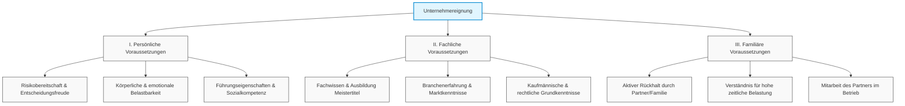

# Lernzusammenfassung Kapitel 1: Voraussetzungen für den Erfolg

Dieses Dokument bietet eine detaillierte Zusammenfassung von Kapitel 1 des Meisterkurses Teil 3 (Bayern).

## Eignungsvoraussetzungen im Überblick
Die unternehmerische Eignung stützt sich auf drei fundamentale Säulen:

## 1.1 Anforderungen an einen Unternehmer

An einen Unternehmer werden verschiedene Anforderungen gestellt, um den Erfolg der beruflichen Selbstständigkeit zu gewährleisten. Diese lassen sich in drei Hauptbereiche unterteilen:

### 1. [[1_1_1_Persoenliche_Anforderungen|Persönliche Anforderungen]]
Eigenschaften wie Risikobereitschaft, Belastbarkeit und Führungskompetenz.

### 2. [[1_1_2_Familiaere_Anforderungen|Familiäre Anforderungen]]
Der Rückhalt im privaten Umfeld und die Unterstützung durch den Partner.

### 3. [[1_1_3_Fachliche_Anforderungen|Fachliche Anforderungen]]
Fachwissen, Branchenerfahrung und kaufmännische Grundkenntnisse.

---

#### Selbstkritische Fragen zur Analyse
Bevor der Schritt in die Selbstständigkeit gewagt wird, sollten folgende Fragen zur eigenen Eignung geklärt werden:
- Was sind meine Motive für die Selbstständigkeit?
- Bin ich der Typ dazu?
- Habe ich die persönliche Stärke?
- Kann ich Wichtiges von Unwichtigem unterscheiden?
- Verfüge ich über eine überdurchschnittliche physische und körperliche Belastbarkeit?
- Kann ich Hobbys/Freizeit vorübergehend opfern?
- Ist mein (Ehe-)Partner unterstützend an Bord?
- Reichen Berufsausbildung und fachliche Qualifikation aus?

---

## 1.1.1 Persönliche Anforderungen

Die erfolgreiche Betriebsgründung oder -übernahme setzt bestimmte persönliche Eigenschaften voraus. Diese müssen vom Existenzgründer vorab kritisch geprüft werden.

### Liste der Anforderungen
- **Risikobereitschaft & Entscheidungsfreude**
- **Verantwortungsbewusstsein**
- **Kommunikationsfähigkeit & Kontaktfreude**
- **Körperliche sowie emotionale Stabilität & Belastbarkeit**
- **Gewissenhaftigkeit**
- **Konflikt- und Krisenmanagement (Flexibilität)**
- **Strategisches Denken & Zielstrebigkeit**
- **Sozialkompetenz & Verhaltensgeschick**
- **Rhetorische Sicherheit**
- **Führungseigenschaften & Durchsetzungsfähigkeit**
- **Motivation & Offenheit für Neues**

### Selbstreflexion & Auslotung
Jeder Existenzgründer im Handwerk sollte sich vor dem Schritt in die Selbstständigkeit fragen, inwieweit er diese Eigenschaften in sich trägt. Dies dient dazu, die persönlichen Voraussetzungen fundiert auszuloten.

---

## 1.1.2 Familiäre Anforderungen

Für den Erfolg des Unternehmens ist es unerlässlich, dass das private Umfeld (Familie/Partner) die Gründung oder Übernahme bejaht und aktiv unterstützt.

### Kernaspekte
- **Keine Trennung von Beruf und Privat:** Unternehmertum lässt sich nach Feierabend nicht einfach "ablegen".
- **Einfluss auf das Privatleben:** Betriebliche Probleme wirken sich direkt auf das Familienleben aus.
- **Startphase:** Hohe persönliche und zeitliche Belastungen sind der Regelfall.
- **Organisation:** Frühzeitige Überlegungen zur Kinderbetreuung sind notwendig.
- **Mitarbeit:** Im Handwerk ist die Mitarbeit des Partners im Betrieb oft üblich und ein wichtiger Erfolgsfaktor.

---

## 1.1.3 Fachliche Anforderungen

Die fachliche Eignung setzt sich aus drei wesentlichen Säulen zusammen: Fachwissen, Branchenerfahrung und kaufmännische Kenntnisse.

### 1. Fachwissen und Fachkenntnisse
- **Ausbildung:** Besitz der notwendigen Ausbildung für die spezifische Selbstständigkeit.
- **Kompetenz:** Beherrschung des Handwerks in Fachtheorie und Fachpraxis.

### 2. Branchenerfahrung
Ein fundierter Überblick über den spezifischen Markt ist essenziell für:
- **Kalkulation:** Kenntnis von Kostenfaktoren und branchenüblichen Kennzahlen.
- **Wettbewerb:** Analyse der spezifischen Wettbewerbssituation.
- **Arbeitsmarkt:** Einschätzung der personellen Lage in der Branche.

### 3. Kaufmännische Grundkenntnisse
Umfassen alle betriebswirtschaftlichen und rechtlichen Aspekte:
- Finanzierung & Rechnungswesen
- Personalwesen & Marketing
- Rechtliche Grundlagen & Steuerpflichten
- Sozial- und Pflichtversicherungen

> [!INFO] Vorteil Handwerksmeister
> Handwerksmeister verfügen durch ihre umfassende Meistervorbereitung bereits über tiefgehende Kenntnisse in all diesen Bereichen.

---
