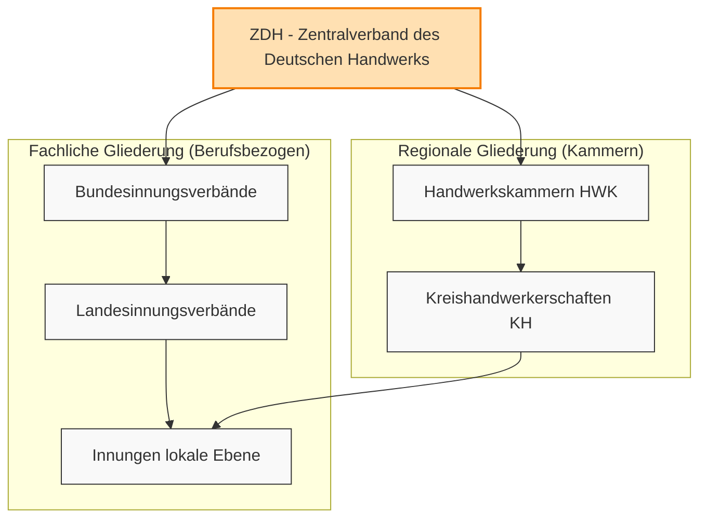

# Lernzusammenfassung Kapitel 2: Bedeutung des Handwerks & Handwerksorganisationen

Dieses Dokument bietet eine detaillierte Zusammenfassung von Kapitel 2 des Meisterkurses Teil 3 (Bayern).

## Aufbau der Handwerksorganisationen
Das Handwerk ist in Deutschland sowohl regional (Handwerkskammern) als auch fachlich (Innungen) organisiert:

## 2.1 Stellung des Handwerks in der Volkswirtschaft

Um die Stellung des Handwerks kompetent beurteilen zu können, ist ein Verständnis grundlegender volkswirtschaftlicher Zusammenhänge notwendig.

### Grundbegriffe
- **Bedürfnisse:** Ausgangspunkt menschlichen Handelns.
- **Bedarf:** Bedürfnisse, die am Markt zu einer Nachfrage nach Gütern und Dienstleistungen führen.
- **Wirtschaft:** Die Herstellung und Verteilung von Gütern und Dienstleistungen zur Befriedigung des Bedarfs.
- **Volkswirtschaft:** Die Gesamtheit der wirtschaftlichen Prozesse eines Landes.

---
#### Unterkapitel
- [[2_1_1_Volkswirtschaftliche_Zusammenhaenge|2.1.1 Grundzüge volkswirtschaftlicher Zusammenhänge]]
- *Weitere Kapitel folgen (z.B. Bedeutung des Handwerks)*

---

## 2.1.1 Grundzüge volkswirtschaftlicher Zusammenhänge

Dieses Kapitel beschreibt die Basismechanismen einer Volkswirtschaft (Produktion, BIP, Geldwesen).

### a) Produktion & Produktionsfaktoren
Die Grundlage jeder Gütererzeugung basiert auf dem Einsatz und der Kombination von:
1. **Boden**
2. **Arbeit**
3. **Kapital**
+ **Unternehmerisches Können:** Erforderlich, um die drei Faktoren optimal wirken zu lassen.

Jedes Unternehmen ist eine Einheit, die durch diese Kombination zur volkswirtschaftlichen Leistung beiträgt.

### b) Bruttoinlandsprodukt (BIP)
Das BIP ist der Maßstab für die gesamtwirtschaftliche Leistung eines Wirtschaftsgebiets (z. B. Deutschland) in einem Zeitraum.

#### Zusammensetzung des BIP:
Die Zusammensetzung des Bruttoinlandsprodukts (BIP) lässt sich über die Verwendungsrechnung darstellen:
$$\text{BIP} = C_{\text{privat}} + I + G_{\text{staat}} + (X - M)$$

Dabei gilt:
- $C_{\text{privat}}$: Privater Konsum (Privater Verbrauch)
- $I$: Bruttoinvestitionen (Investitionen)
- $G_{\text{staat}}$: Staatsausgaben (Staatsverbrauch)
- $(X - M)$: Außenbeitrag (Exporte $X$ minus Importe $M$)

#### Bedeutung des Handwerks:
- Das **Handwerk trägt ca. 8 %** zur gesamten Wirtschaft bei.
- Wirtschaftswachstum (höhere Leistung pro Arbeitskraft) erhöht das BIP.

#### Verwendung/Verteilung (ca. Werte):
- **Privater Verbrauch:** ~50 % (führend)
- **Investitionen / Staatsverbrauch:** je ~21–22 %
- **Sonstiges (Außenbeitrag/Vorräte):** ~6 %

### c) Geld und Währung
Geld existiert als **Bargeld** und **Buchgeld**. Sein Wert beruht auf der **Kaufkraft**.

#### Kaufkraft-Mechanik:
Das Verhältnis von **Geldvorrat** zu **Gütervorrat** bestimmt den Wert:
- **Inflation:** Geldmenge steigt bei gleicher Warenmenge $\rightarrow$ Geldwert sinkt (Preissteigerung).
- **Deflation:** Geldmenge sinkt bei gleicher Warenmenge $\rightarrow$ Kaufkraft steigt (Preissenkung).

#### Währung & Europäische Zentralbank (EZB):
- **Währung:** Ordnung des Geldwesens und Zahlungsverkehrs.
- **EZB (Frankfurt):** Hat die geldpolitische Verantwortung in der Währungsunion.
- **Hauptziel:** Sicherung der **Preisstabilität** und eines stabilen Euro (unabhängig von Regierungen).

- [[2_1_1_d_e_Wirtschaftssysteme_Politik|2.1.1.d & e Wirtschaftssysteme und Wirtschaftspolitik]]

---

## 2.1.2 Wirtschaftliche Bedeutung des Handwerks

Das Handwerk ist ein tragender Pfeiler der Volkswirtschaft. Seine Stärke liegt in der Deckung des gehobenen Bedarfs, persönlichen Dienstleistungen und individuellen Problemlösungen.

### Unterkapitel
- [[2_1_2_a_Aufgaben_Handwerk|2.1.2.a Aufgaben des Handwerks]]
- [[2_1_2_b_Strukturwandel_Zukunft|2.1.2.b Strukturwandel und Zukunftsperspektiven]]
- [[2_1_2_c_Leistungsstruktur_Handwerk|2.1.2.c Leistungsstruktur des Handwerks]]
- [[2_1_2_d_Statistik_Handwerk|2.1.2.d Betriebe, Unternehmer, Beschäftigte und Umsätze]]

---

## 2.1.2.a Aufgaben des Handwerks

Die Aufgabenschwerpunkte des Handwerks sind vielfältig und oft komplementär zur Industrie.

### Aufgabenschwerpunkte
- **Neuerstellung:** Bauleistung, Installation, Montage.
- **Zulieferung:** Spezialteile und Leistungen für die Industrie.
- **Dienstleistung & Handel:** Kundennahe Versorgung.
- **Reparatur:** Instandsetzung industrieller und handwerklicher Erzeugnisse.
- **Individualität:** Befriedigung des spezifischen, nicht-standardisierten Bedarfs.

### Hauptgebiete der Tätigkeit
1. **Bauwirtschaft:** Neubau, Modernisierung und Sanierung.
2. **Persönlicher Bedarf:** Individuelle Produkte und Kleinserien.
3. **Dienstleistungen:** Personenbezogene und gewerbliche Services.

### Handwerk vs. Industrie
Es besteht ein Wechselspiel aus Kooperation und Konkurrenz:
- **Zuliefererrolle:** Handwerk liefert Spezialmaschinen, Werkzeuge, Modelle und Einzelteile an die Industrie.
- **Veredelung:** Viele industrielle Erzeugnisse werden erst durch handwerkliche Montage zu einem gebrauchsfähigen Gut.
- **Abgrenzung:** Industrie setzt auf Massenproduktion und Großanlagen; Handwerk auf Individualität.
- **Entstehung:** Neue Handwerkszweige entstehen oft aus der Industrie (z. B. Kfz-Handwerk aus der Kfz-Industrie).
- **Verdrängung:** In manchen Bereichen verdrängt die Industrie das Handwerk (z. B. Bekleidung).

---

## 2.1.2.b Strukturwandel und Zukunftsperspektiven

Das Handwerk befindet sich in einem ständigen technisch und wirtschaftlich bedingten Strukturwandel.

### Herausforderungen
- **Personal:** Nachwuchs- und Fachkräftemangel.
- **Kosten:** Steigende Arbeitskosten, Rohstoff- und Energiepreise.
- **Rahmenbedingungen:** Bürokratie, Flächenverknappung, mangelnde politische Berücksichtigung.
- **Markt:** Verdrängungswettbewerb, Plattformökonomie, Konkurrenz aus Niedriglohnländern.
- **Technik:** Rasante technologische Entwicklung, Lieferkettenprobleme.
- **Gesellschaft:** Demografischer Wandel, Sättigung bei Standardgütern.
- **Legalität:** Schwarzarbeit und illegale Tätigkeiten.

### Maßnahmen zur Bewältigung
- **Betriebe:** Anpassung des Leistungsangebots, Nutzung von IKT (EDV/KI), auftragsbezogene Kooperationen.
- **Organisationen:** Ausbau der Beratung, Nachwuchssicherung, Exportförderung.
- **Politik:** Unterstützung auf EU-, Bundes- und Landesebene.

### Zukunftsperspektiven & Chancen
Trotz des Wandels sind die Aussichten positiv, sofern neue Trends genutzt werden:
- **Nachhaltigkeit:** Energiewende (zentraler Punkt), Umweltschutz, Recycling.
- **Recht auf Reparatur:** Stärkung des Reparatursektors.
- **Innovation:** Elektromobilität, Smart Home / Smart Building, Virtual Reality.
- **Individualisierung:** Kundennähe und Komplettlösungen aus einer Hand.
- **Digitalisierung:** Effizienzsteigerung durch KI und neue Technologien.

> [!IMPORTANT] Fazit
> Der Wandel führt zu neuen Berufen, veränderten Tätigkeitsschwerpunkten und neuen Betriebsgrößen. Ständige Anpassung ist die Überlebensstrategie.

---

## 2.1.2.c Leistungsstruktur des Handwerks

Das Handwerk erwirtschaftet etwa **9 % aller Umsätze** deutscher Unternehmen. Die Leistungsstruktur ist durch eine hohe Vielseitigkeit geprägt.

### Wirtschaftliche Funktionen des Handwerks

#### 1. Konsumgüterhandwerke
Diese sind primär auf den **privaten Verbrauch** ausgerichtet.
- **Lebensmittelhandwerk:** Versorgung der Bevölkerung (Brot, Wurst, Brauereien).
- **Bekleidung, Textil & Leder:** Vor allem Bekleidungshandwerke.
- **Haushalt & Wohnbedarf:** Innenraumgestaltung und Ausstattung.
- **Verkehrs- & Mobilitätsbedarf:** Handwerke rund um Fahrzeuge.
- **Körper- & Gesundheitspflege:** Starke Zukunftschancen aufgrund der demografischen Entwicklung (alternde Bevölkerung).
- **Unterhaltungs- & Freizeitbedarf:** Befriedigung des persönlichen Bedarfs.

#### 2. Investitionsgüterhandwerke
Diese leisten einen erheblichen Beitrag zur Infrastruktur und industriellen Basis.
- **Bau- und Ausbauhandwerk:**
	- Tätig im Wohnungsbau, gewerblichen Bau sowie öffentlichen Hoch- und Tiefbau.
	- Fokus auf Sanierung und Modernisierung.
	- **Stärkste Gruppe:** Macht **47 % des Gesamthandwerksumsatzes** aus.
- **Technische Investitionsgüterhandwerke:**
	- Zulieferer für Investitionsgüterproduzenten.
	- Herstellung maschineller Ausrüstungen.
	- Montage, Reparatur und Wartung von Maschinen/Anlagen.
	- Chancen durch **Industrie 4.0**.

#### 3. Dienstleistungshandwerke für die gewerbliche Wirtschaft
*(Ergänzung gemäß Systematik: Handwerke, die Leistungen direkt für andere Unternehmen erbringen).*

---

## 2.1.2.d Betriebe, Unternehmer, Beschäftigte und Umsätze

Die statistischen Kennzahlen unterstreichen die Rolle des Handwerks als "Wirtschaftsmacht von Nebenan".

### Eckdaten (Stand 2023)
- **Betriebe:** Über **1 Million** Handwerksbetriebe und handwerksähnliche Betriebe. (Starke Erhöhung im Vergleich zu 2022).
- **Beschäftigte:** **5,6 Millionen** Erwerbstätige im Handwerk.
- **Umsatz:** **766 Milliarden Euro** Gesamtumsatz.

### Strukturmerkmale
- Das Handwerk ist mittelständisch geprägt.
- Die Mehrheit der Personen arbeitet in **sehr kleinen Unternehmen**.

---

## 2.1.3 Gesellschaftliche Bedeutung des Handwerks

Das Handwerk ist ein wesentlicher Pfeiler für die Stabilität und Struktur der Gesellschaft.

### Kernaspekte der gesellschaftlichen Bedeutung
- **Grundlage der Selbstständigkeit:** Das Handwerk ermöglicht eine Vielzahl selbstständiger Existenzen, was für das Funktionieren einer Marktwirtschaft essenziell ist.
- **Beschäftigungsquelle:** Neben Angestellten bilden Inhaber und mitarbeitende Familienangehörige ein tragendes Element.
- **Gründungsdynamik:** Jährlich tausende Neugründungen sichern den Bestand und schaffen neue Arbeitsplätze.
- **Werte:** Handwerkliche Selbstständigkeit erfordert und fördert Eigenverantwortung, Initiative und Risikofreudigkeit.
- **Regionale Struktur:** Die breite Streuung der Betriebe (Stadt und Land) sorgt für eine gesunde, sozial ausgewogene Struktur der Volkswirtschaft.
- **Ehrenamt:** Zahlreiche Handwerker engagieren sich über den eigenen Betrieb hinaus ehrenamtlich in Handwerksorganisationen und allen Bereichen der Gesellschaft.

---

## 2.1.4 Kulturelle Bedeutung des Handwerks

Das Handwerk ist ein aktiver Gestalter des kulturellen Lebensraums.

### Kernaspekte der kulturellen Bedeutung
- **Gestaltung von Lebensräumen:** Handwerkliche Arbeit prägt das Erscheinungsbild und die Atmosphäre von Regionen.
- **Kulturelle Identität:** Trägt zur Sicherung und Fortführung regionaler Identitäten bei.
- **Vielfalt & Formgebung:** Leistet einen wesentlichen Beitrag zur kulturellen Vielfalt und ästhetischen Formgestaltung.

---

## 2.2 Handwerksorganisationen: Übersicht

Die Handwerksorganisationen in Deutschland sind zweigleisig aufgebaut: **fachlich** (nach Handwerkszweig) und **regional** (nach Bezirk).

### Organisationsstruktur

#### 1. Fachliche Organisationen (Berufsspezifisch)
- **Innungen:** Basis auf lokaler Ebene (freiwillig).
- **Landesinnungsverbände:** Zusammenschluss der Innungen auf Landesebene.
- **Bundesinnungsverbände:** Zusammenschluss der Landesverbände auf Bundesebene.

#### 2. Regionale Organisationen (Übergreifend)
- **Kreishandwerkerschaften:** Zusammenschluss der Innungen eines Stadt-/Landkreises.
- **Handwerkskammern (HWK):** Gesetzliche Vertretung des Gesamthandwerks im Kammerbezirk.

#### Dachorganisationen
- **ZDH (Zentralverband des Deutschen Handwerks):** Spitzenverband auf Bundesebene, in dem sowohl die HWKs als auch die Bundesinnungsverbände vertreten sind.

---
### Unterkapitel
- [[2_2_a_Innung|2.2.a Die Innung]]
- [[2_2_b_Kreishandwerkerschaft|2.2.b Die Kreishandwerkerschaft]]
- [[2_2_c_Handwerkskammer|2.2.c Die Handwerkskammer (HWK)]]
- [[2_2_d_Innuengsverbaende|2.2.d Landes- und Bundesinnungsverbände]]
- [[2_2_e_Sonstige_Organisationen|2.2.e Sonstige Organisationen (Junioren, Frauen, Gesellen)]]

---

## 2.2.a Die Innung

Die Innung ist der **freiwillige** Zusammenschluss von Inhabern gleicher oder sich nahestehender Handwerke. Sie ist eine **Körperschaft des öffentlichen Rechts**.

### Aufgaben der Innung
Die Aufgaben werden in drei Kategorien unterteilt:

#### 1. Pflichtaufgaben
- Vertretung der gemeinsamen gewerblichen Interessen.
- Pflege des Gemeingeistes und der Berufsehre.
- Regelung und Überwachung der Lehrlingsausbildung.
- Abnahme von Gesellenprüfungen (bei Ermächtigung durch die HWK).
- Förderung des handwerklichen Könnens (Fachschulen, Lehrgänge).

#### 2. Sollaufgaben
- Schaffung von Einrichtungen zur Verbesserung der Arbeitsweise.
- Beratung von Vergabestellen bei öffentlichen Leistungen.

#### 3. Kannaufgaben
- Abschluss von **Tarifverträgen** (sofern kein Innungsverband dies tut).
- Errichtung von Unterstützungskassen (Krankheit, Tod).
- Schlichtung von Streitigkeiten zwischen Mitgliedern und Auftraggebern.

### Organe und Struktur
- **Innungsversammlung:** Oberstes Organ (Beschlüsse, Wahlen, Satzung). Jedes Mitglied hat 1 Stimme.
- **Vorstand:** Ausführung der Beschlüsse und Vertretung nach außen. Vorsitzender = **Obermeister**.
- **Ausschüsse:** z. B. für Berufsausbildung, Schlichtung, Gesellenprüfung.

### Finanzierung
Erfolgt durch Beiträge der Mitglieder, die in der Innungsversammlung festgesetzt werden.

---

## 2.2.b Die Kreishandwerkerschaft (KH)

Die Kreishandwerkerschaft ist der Zusammenschluss aller Innungen eines Stadt- oder Landkreises. Sie ist eine **Körperschaft des öffentlichen Rechts**.

### Aufgaben
- Wahrnehmung der Interessen des **Gesamthandwerks** im Bezirk.
- Unterstützung der Mitgliedsinnungen bei deren Aufgaben.
- **Geschäftsführung:** Kann auf Antrag die Verwaltung der einzelnen Innungen übernehmen.
- Erteilung von Gutachten und Auskünften für Behörden.
- Durchführung von Vorschriften der Handwerkskammer.

---

## 2.2.c Die Handwerkskammer (HWK)

Die HWK ist die **gesetzliche Berufsstandsvertretung** des Gesamthandwerks. Die Mitgliedschaft ist für alle Handwerksbetriebe (Inhaber, Gesellen, Lehrlinge) **verpflichtend**.

### Hauptaufgabenbereiche

#### 1. Interessensvertretung
- Mitwirkung bei Gesetzesinitiativen.
- Kontakte zu Behörden und Parlamenten.
- Öffentlichkeitsarbeit und Konjunkturberichterstattung.

#### 2. Handwerksförderung
- **Berufsbildung:** Überbetriebliche Unterweisung (ÜLU), Meisterkurse, Nachwuchswerbung.
- **Beratung:** Existenzgründung, Betriebsführung, Technik, Umweltschutz.
- **Messen:** Organisation und Beteiligung an Ausstellungen.

#### 3. Selbstverwaltung (Hoheitliche Aufgaben)
- **Rollenführung:** Handwerksrolle, Verzeichnis der zulassungsfreien Handwerke, Lehrlingsrolle.
- **Prüfungswesen:** Organisation der Meisterprüfungen, Überwachung der Gesellenprüfungen.
- **Sachverständige:** Bestellung und Vereidigung.
- **Aufsicht:** Über Innungen und Kreishandwerkerschaften.

### Organe
- **Vollversammlung:** Oberstes Organ (gewählte Vertreter von Arbeitgebern und Arbeitnehmern im Verhältnis 2:1).
- **Vorstand:** Präsident (Arbeitgeber) und zwei Vizepräsidenten (davon einer Arbeitnehmer/Geselle).
- **Hauptgeschäftsführer:** Führt die laufenden Verwaltungsgeschäfte.

### Finanzierung
- **Beiträge:** Grundbeitrag + Zusatzbeitrag (orientiert an Gewinn/Gewerbeertrag).
- **Sonderregelung für Gründer:** In den ersten 4 Jahren bei Gewinn < 25.000 € (bzw. 5.200 € bei unwesentlichen Tätigkeiten).

---

## 2.2.d Landes- und Bundesinnungsverbände

Diese Verbände bilden die fachliche Vertretung auf höherer Ebene. Sie sind **juristische Personen des privaten Rechts**.

### Landesinnungsverband (LIV)
- Zusammenschluss der Innungen eines Fachzweigs im Bundesland.
- **Aufgaben:** Interessenvertretung auf Landesebene, Abschluss von **Tarifverträgen**, fachliche Beratung, Förderung des Genossenschaftswesens.

### Bundesinnungsverband (BIV)
- Zusammenschluss der Landesinnungsverbände auf Bundesebene.
- **Aufgaben:** Interessenvertretung des speziellen Handwerks auf Bundes- und EU-Ebene.

---

## 2.2.e Sonstige Organisationen

Ergänzende Gruppen, die spezifische Interessen innerhalb des Handwerks vertreten.

### 1. Handwerksjunioren
- **Zielgruppe:** Junge Handwerker und Existenzgründer.
- **Aufgaben:** Weiterbildung, Erfahrungsaustausch, Vorbereitung auf ehrenamtliche Rollen in der Selbstverwaltung.

### 2. Unternehmerfrauen im Handwerk (UFH)
- **Zielgruppe:** Frauen, die als Mitunternehmerinnen, Meisterinnen oder Familienangehörige im Betrieb arbeiten.
- **Aufgaben:** Vernetzung, Fortbildung, Stärkung der Rolle der Frau im Handwerk.

### 3. Gesellenvereinigungen
- Zusammenschlüsse von Gesellen (oft konfessionell oder berufsspezifisch), die soziale und berufliche Ziele verfolgen.

---

## 2.2.2 Dienstleistungen der Handwerksorganisationen

Die Handwerksorganisationen bieten ihren Mitgliedern ein breites Spektrum an Dienstleistungen, die primär als **Hilfe zur Selbsthilfe** dienen. Ziel ist die Erhaltung und Steigerung der Wettbewerbsfähigkeit.

### Grundprinzip der Handwerksförderung
- **Aufgabe:** Ausgleich betriebsgrößenbedingter Wettbewerbsnachteile.
- **Notwendigkeit:** Ständige Anpassung an technische und wirtschaftliche Entwicklungen (Industrie 4.0, Digitalisierung).
- **Kompetenzbereiche:** Handwerkliches & fachtheoretisches Können, betriebswirtschaftliche Kenntnisse und Handlungskompetenz.

---
### Unterkapitel
- [[2_2_2_a_Beratungsangebote|2.2.2.a Beratungsangebote im Einzelnen]]
- [[2_2_2_b_Messen_Forschung|2.2.2.b Messen, Ausstellungen und Forschung]]

---

## 2.2.2.a Beratungsangebote im Einzelnen

Die Beratungsdienste werden überfachlich (HWK) und fachspezifisch (Innungen/Verbände) angeboten.

### 1. Betriebswirtschaftliche Beratung
Fokus auf eine gesunde Unternehmensorganisation:
- **Existenzgründung & Übernahme:** Businessplan, Finanzplanung, Kapitalbeschaffung.
- **Unternehmensführung:** Rechnungswesen, Investitionen, Personalwesen.
- **Analyse:** Wirtschaftlichkeitsanalysen, Schwachstellen- und Verlustquellenforschung.
- **Markt:** Marktanalysen, Kooperationsmöglichkeiten.

### 2. Technische Betriebs- & Technologieberatung
Unterstützung bei technologischen Sprüngen:
- **Planung:** Betriebsstätte und Fertigungswirtschaft.
- **Innovation:** Digitalisierung, Technologietransfer, Verfahrenstechnik.
- **Qualität & Normen:** Qualitätsmanagement (Zertifizierung), CE-Kennzeichnung.
- **IT-Beratung:** Einsatz von EDV/IT in Büro und Werkstatt, Reaktion auf Industrie 4.0.

### 3. Außenwirtschafts- & EU-Beratung
Unterstützung für exportfähige Betriebe:
- **Markteintritt:** Zollvorschriften, Normen im Ausland, Warenimport/-export.
- **Abwicklung:** Zahlungsbedingungen, Devisen, Exportfinanzierung.

### 4. Rechtsberatung
Auskunft in einschlägigen Rechtsgebieten (keine Steuerberatung!):
- Zivilrecht, Arbeitsrecht, Sozialversicherungsrecht, Steuerrecht (Grundlagen).

### 5. Spezialberatungen
- **Umweltberatung:** Einhaltung von Vorschriften & Positionierung als Problemlöser für den Klimaschutz.
- **Formgestaltung/Design:** Verkaufswirksame Produktgestaltung, Wertarbeit-Präsentation.
- **Bildungsberatung:** Aus- und Fortbildungsberatung (Details in Band 4).

---

## 2.2.2.b Messen, Ausstellungen und Forschung

Neben der direkten Beratung fördern Organisationen das Handwerk durch übergeordnete Maßnahmen.

### Messen & Ausstellungen
Formen: Fachmessen, regionale Verbraucherschauen, **Internationale Handwerksmesse (IHM) in München**, Auslandsausstellungen.

#### Ziele von Messebeteiligungen:
- **Absatz & Beschaffung:** Förderung des Verkaufs und Erschließung von Einkaufswegen.
- **Image:** Nachwuchswerbung und Öffentlichkeitsarbeit.
- **Netzwerk:** Anbahnung von Kooperationen (auch Industrie/Handwerk).
- **Information:** Forum für Fachtagungen und technologischen Austausch.

### Wissenschaft & Forschung
Das Handwerk wird durch wissenschaftliche Institute unterstützt, um die Wettbewerbsfähigkeit zu stärken.

#### Deutsches Handwerksinstitut (DHI)
Wichtige Forschungsbereiche:
- Technik & Organisation.
- Qualifizierung & Bildungsforschung.
- Handwerkswirtschaftsrecht.
- **Nutzen:** Ergebnisse dienen als Grundlage für handwerkspolitische Entscheidungen und werden den Betrieben zur Verfügung gestellt.

---
