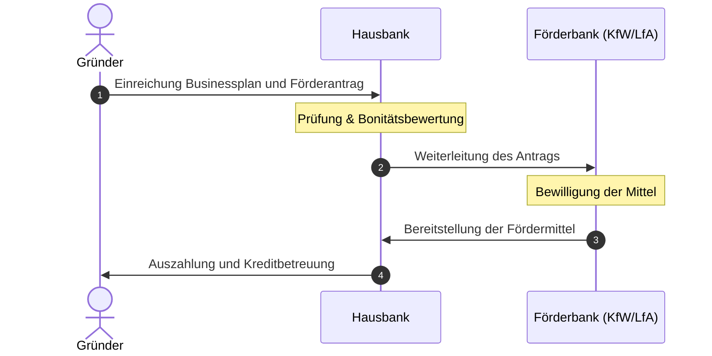

# Lernzusammenfassung Kapitel 3: Beratung und Förderung

Dieses Dokument bietet eine detaillierte Zusammenfassung von Kapitel 3 des Meisterkurses Teil 3 (Bayern).

## Das Hausbankprinzip bei öffentlichen Fördermitteln
Öffentliche Fördermittel können nicht direkt bei der KfW oder LfA beantragt werden. Der Ablauf folgt dem Hausbankprinzip:

## 3. Möglichkeiten der Inanspruchnahme von Beratungs-, Förder- und Unterstützungsleistungen

Dieses Kapitel behandelt die gezielte Vorbereitung auf die Selbstständigkeit durch externe Expertise und staatliche Förderung.

### Kompetenzen
- Anlaufstellen für Gründungsberatung kennen und bewerten.
- Öffentliche Förderprogramme und deren Voraussetzungen auswählen.

---
### Unterkapitel
- [[3_1_Gruendungsberatung|3.1 Gründungsberatung]]
- [[3_1_1_Rechtliche_Aspekte|3.1.1 Rechtliche Aspekte]]
- [[3_2_1_Oeffentliche_Foerdermittel|3.2.1 Öffentliche Förder- und Finanzierungsmittel]]
- [[3_2_2_a_Definition_KMU|3.2.2.a Definition KMU & Voraussetzungen]]
- [[3_2_2_c_ERP_Programme|3.2.2.c ERP-Förderprogramme (KfW)]]
- [[3_2_2_d_Buergschaftsbanken|3.2.2.d Bürgschaftsbanken]]

---

## 3.1 Gründungsberatung

Eine gründliche Beratung vor der Selbstständigkeit ist essenziell, um existenzgefährdende Fehler zu vermeiden.

### Anlaufstellen für Existenzgründer
Neben den Handwerksorganisationen (HWK, Innungen) stehen folgende Experten zur Verfügung:
- **Freiberufliche Unternehmensberater**
- **Rechtsanwälte & Notare**
- **Steuerberater** (unverzichtbar für steuerliche Pflichten)
- **Wirtschaftsförderungsstellen:** Von Gemeinden, Städten oder Landkreisen.
- **Banken & Sparkassen:** Fokus auf Finanzierung.
- **Agenturen für Arbeit:** (z. B. Gründungszuschuss).
- **Gründernetzwerke & Internetportale**

### Förderprogramm "Förderung von Unternehmensberatungen für KMU"
Dieses Programm des Bundes unterstützt KMU auch *nach* der Gründung bei zentralen Herausforderungen.

#### Beratungsschwerpunkte:
- **Wirtschaftlich/Finanziell:** Optimierung der Unternehmensführung.
- **Personal:** Fachkräftesicherung und -bindung.
- **Strategie:** Anpassung des Geschäftsmodells an Kostensteigerungen.
- **Prinzipien:** Berücksichtigung von Gleichstellung, Chancengleichheit und ökologischer Nachhaltigkeit.

---

## 3.1.1 Rechtliche Aspekte

Für eine erfolgreiche Existenzgründung müssen verschiedene Rechtsgebiete bereits in der Planungsphase berücksichtigt werden.

### Kernbereiche der Gründung
- [[3_1_1_a_Rechtsformen|3.1.1.a Wahl der Rechtsform]]
- [[3_1_1_b_Formalitaeten|3.1.1.b Anmeldungen und Formalitäten]]

### Einschlägige Rechtsgebiete für das Handwerk
... (rest of the file)
- **Handwerksrecht:** Prüfung der Voraussetzungen nach der Handwerksordnung (HwO).
- **Handelsrecht:** Beachtung von Vorschriften des Kaufrechts.
- **Steuerrecht:** Erfüllung der steuerlichen Pflichten als Betriebsinhaber.
- **Baurecht:** Genehmigungsfähigkeit von baulichen Anlagen (Werkstatt, Lager).
- **Umweltschutz- / Immissionsschutzrecht:** Schutz vor schädlichen Umwelteinwirkungen.
- **Abfallrecht:** Anforderungen an Umgang, Transport und Entsorgung von Abfällen.
- **Arbeitsstättenverordnung:** Sicherheit und Gesundheitsschutz der Beschäftigten am Arbeitsplatz.

> [!NOTE] Vertiefung
> Diese Themen werden detailliert in **Lernsituation 8** (Gründungsrelevante Rechtsvorschriften) behandelt.

---

## 3.1.1.a Wahl der Rechtsform

Die Wahl der Rechtsform ist eine strategische Entscheidung mit Auswirkungen auf Haftung, Kapital und Unabhängigkeit.

### Grundtypen der Rechtsformen

#### 1. Einzelunternehmen
Die häufigste Form im Handwerk.
- **Vorteil:** Maximale Unabhängigkeit und Selbstständigkeit.
- **Nachteil:** Inhaber trägt das Risiko allein; haftet mit **Betriebs- und Privatvermögen**.
- **Unterscheidung:** Kaufmann vs. Nichtkaufmann.

#### 2. Gesellschaften
- **Personengesellschaften:** GbR (Gesellschaft bürgerlichen Rechts), OHG (Offene Handelsgesellschaft), KG (Kommanditgesellschaft).
- **Kapitalgesellschaften:** 
	- **GmbH:** Gesellschaft mit beschränkter Haftung.
	- **UG (haftungsbeschränkt):** "Mini-GmbH", Sonderform ohne hohes Mindeststammkapital.

### Entscheidungskriterien (Prüffragen)
- Sind die **handwerksrechtlichen Voraussetzungen** erfüllt?
- Ist eine Eintragung im **Handelsregister** nötig?
- Welche **Formvorschriften** und **Kosten** fallen an?
- Wie soll die **Finanzierung** (Eigen-/Fremdkapital) gestaltet werden?
- Gründung allein oder im Team?
- **Haftung:** Soll das Privatvermögen geschützt werden (Risikobegrenzung)?
- Welche **Gewinn- und Verlustverteilung** ist gewünscht?
- Welche **Firmierung** (Name) wird angestrebt?

---

## 3.1.1.b Anmeldungen und Formalitäten

Eine Existenzgründung erfordert zahlreiche Behördengänge. Viele Daten werden über die Gewerbeanmeldung automatisch weitergeleitet.

### Zentrale Anlaufstellen & Anmeldungen

#### 1. Handwerkskammer (HWK)
- Eintragung in die **Handwerksrolle** (zulassungspflichtig) oder das **Verzeichnis** (zulassungsfrei/ähnlich).
- Ausstellung der **Handwerkskarte / Gewerbekarte**.
- In einigen Bundesländern kann die Gewerbeanmeldung direkt über die Kammern erfolgen.

#### 2. Handels- & Gesellschaftsregister (Amtsgericht)
- Bei Vorliegen der Voraussetzungen ist eine Eintragung in das jeweilige Register erforderlich.
- **Transparenzregister:** Alle im Handelsregister eingetragenen Gesellschaften müssen ihre wirtschaftlich Berechtigten zusätzlich elektronisch melden.

#### 3. Gewerbeamt
- Registrierung der **Gewerbeanmeldung**.
- Information an weitere zuständige Institutionen.

#### 4. Finanzamt
- Ausfüllen des Fragebogens zur steuerlichen Erfassung.
- Zuteilung der **Steuernummer**.

#### 5. Agentur für Arbeit
- Zuteilung einer **Betriebsnummer**, sofern Arbeitnehmer beschäftigt werden.

#### 6. Branchenbezogene Versorgungseinrichtungen
- Erforderlich je nach Branche (z. B. im Baugewerbe).

#### 7. Gewerbeaufsichtsamt
- Überwachung der **Arbeitsschutzgesetze**.

#### 8. Berufsgenossenschaften (BG)
- Zuständig für die **Pflichtversicherung** der Arbeitnehmer (Gesetzliche Unfallversicherung).
- Je nach Satzung: Pflicht- oder freiwillige Versicherung des Unternehmers.

#### 9. Krankenkasse / Minijob-Zentrale
- Anmeldung der Arbeitnehmer bei einer gesetzlichen Krankenkasse.
- Geringfügig Beschäftigte werden bei der **Minijob-Zentrale** gemeldet.

#### 10. Versorgungsunternehmen & Kommunikation
- Abschluss von Lieferverträgen (Strom, Gas, Wasser) und Entsorgungsverträgen (Abfall/Abwasser).
- Rechtzeitige Einrichtung von Telefon, Internet und E-Mail.

#### 11. Bauamt
- Abstimmung und Beantragung von gewerblichen Um- und Neubauten oder Nutzungsänderungen.

### Besondere Register
- **Handelsregister / Gesellschaftsregister** (je nach Rechtsform).
- **Transparenzregister.**

### Besonderheit: Mischbetriebe
Betriebe, die neben dem Handwerk auch Handel betreiben, können zusätzlich zur HWK auch der **IHK** (Industrie- und Handelskammer) angehören. Hier ist eine Beratung durch die HWK dringend empfohlen.

---

## 3.1.2 Konzeptionelle Aspekte

Jede Existenzgründung basiert auf einer fundierten Planung, die in einem schriftlichen Konzept mündet.

### Die Geschäftsidee
- Kernfrage: Womit gewinne ich ausreichend Kunden?
- Muss nicht zwingend eine völlig neue Innovation sein; entscheidend ist die **intensive Planung** und **durchdachte Umsetzung**.

#
### Der Businessplan (Detaillierte Struktur)
Der Businessplan (Unternehmenskonzept) ist das zentrale Werkzeug der Vorbereitung und ein Muss für Kreditinstitute sowie öffentliche Fördermittel.

> [!IMPORTANT] Prüfungsrelevantes Wissen: Die 8 Hauptbestandteile eines Businessplans
> In der Meisterprüfung wird regelmäßig nach den wesentlichen Säulen des Businessplans gefragt. Dies sind:
> 
> 1. **Geschäftsidee & Vorhabensbeschreibung (Executive Summary):** 
>    - Zusammenfassung des gesamten Vorhabens (Wer, Was, Warum).
>    - Definition des Kundennutzens und des Alleinstellungsmerkmals (USP).
> 2. **Gründerprofil (Unternehmerpersönlichkeit):** 
>    - Fachliche Eignung (Meistertitel, Berufserfahrung).
>    - Kaufmännische Qualifikationen und persönliche Stärken.
> 3. **Marktanalyse & Wettbewerb:** 
>    - Zielgruppendefinition (Privat, Gewerblich, Öffentlich).
>    - Analyse der Standortfaktoren und Mitbewerber (Stärken/Schwächen der Konkurrenz).
> 4. **Marketing & Vertrieb:** 
>    - Preisbildung und Preisstrategie (Kalkulation).
>    - Marketing-Mix: Werbung, Kommunikation, Kundengewinnung.
>    - Vertriebswege (Direkt-, Online-, Indirektvertrieb).
> 5. **Organisation & Standort:** 
>    - Wahl der Rechtsform (inkl. Begründung).
>    - Standortwahl (Gewerbefläche, Erreichbarkeit, Nutzungsänderungen).
>    - Technische Ausstattung und Maschinenpark.
> 6. **Personalplanung:** 
>    - Personalbedarf (Gesellen, Lehrlinge, Aushilfen).
>    - Anforderungsprofile und Eignungskriterien.
>    - Personalbeschaffung und Nachwuchssicherung.
> 7. **Finanzteil (Zahlenteil):** 
>    - Kapitalbedarfsplan und Investitionsplan.
>    - Finanzierungsplan (Eigenkapital, öffentliche Darlehen, Sicherheiten).
>    - Rentabilitätsvorschau (Umsatz- und Ertragsvorschau).
>    - Liquiditätsplan (monatlicher Geldfluss im ersten Jahr zur Sicherung der Zahlungsfähigkeit).
> 8. **Anhang:** 
>    - Lebenslauf, Zeugnisse, Verträge, Angebote, Fachgutachten.
### Gestaltungsanforderungen:
- Klare Gliederung und verständlicher Schreibstil.
- Prägnante Informationen (evtl. Tabellen/Grafiken).
- Inhaltliche Stimmigkeit und ansprechendes äußeres Erscheinungsbild.

---

## 3.1.3 Finanzielle Aspekte

Die Gründungsfinanzierung entscheidet oft über den langfristigen Erfolg eines Unternehmens. Eine knappe Kalkulation sollte vermieden werden.

### Finanzierungspartner
Neben der Hausbank kommen folgende Partner infrage:
- Öffentliche Kapitalgeber (Bund/Länder) & **Förderbanken**.
- **Bürgschaftsbanken** (bei fehlenden Sicherheiten).
- Kapitalbeteiligungsgesellschaften.
- Agentur für Arbeit.

### Eigenkapital (EK)
- **Empfehlung:** Mindestens **20 %** der Gesamtkosten.
- **Bedeutung:** Verbessert das **Rating** (Bonität) bei Banken.
- **Signalwirkung:** Gründer zeigt Bereitschaft, Risiken selbst mitzutragen.
- Ohne ausreichendes EK ist Fremdfinanzierung oft unmöglich oder sehr teuer.

### Alternative Finanzierungsformen
- **Leasing:** Nutzung von Investitionsgütern gegen Gebühr.
- **Factoring:** Verkauf von Forderungen zur sofortigen Liquidität.
- **Venture Capital:** Privates Beteiligungskapital.
- **Crowdfunding:** Einwerben von Kapital über das Internet von vielen Kleingeldgebern.

---

## 3.2.1 Angebote für Existenzgründer

Bund und Länder fördern Existenzgründungen durch öffentliche Finanzierungshilfen, um die Volkswirtschaft zu erneuern und Arbeitsplätze zu schaffen.

### Merkmale öffentlicher Finanzhilfen
- **Zinskonditionen:** Günstiger als marktübliche Kredite (risikoorientiert nach Bonität/Sicherheiten).
- **Tilgung:** Günstige Bedingungen, teilweise mit Tilgungszuschüssen.
- **Zuschüsse:** Teilweise nicht rückzahlbare Zuschüsse.

### Das Antragsverfahren: Wichtige Regeln
> [!DANGER] Verbot des vorzeitigen Vorhabensbeginns
> Anträge müssen **vor Beginn der Investitionen** gestellt werden. Bereits getätigte Anschaffungen können in der Regel nicht mehr gefördert werden.

#### Erforderliche Unterlagen
- **Businessplan:** Ausführliche Beschreibung und Begründung (zentrale Grundlage).
- **Finanzplanung:** Investitionsplan, Kapitalbedarfsermittlung, Finanzierungsplan, Liquiditätsplanung.
- **Wirtschaftlichkeit:** Umsatz-, Gewinn- und Kostenplanung, Rentabilitätsvorschau.
- **Sonstiges:** Angebote, wichtige Verträge, Unterlagen über Sicherheiten, Lebenslauf.

### Wichtige Förderprogramme
1. **Beraterförderung:** Unterstützung bei der Einholung von Expertenrat.
2. **ERP-Gründerkredit StartGeld:** Für kleinere Gründungsvorhaben.
3. **ERP-Förderkredit Gründung und Nachfolge:** Für größere Investitionen.
4. **ERP-Förderkredit KMU:** Für etablierte mittelständische Unternehmen.
5. **Gründung aus der Arbeitslosigkeit:**
	- **Gründungszuschuss:** Für Empfänger von Arbeitslosengeld (ALG I).
	- **Einstiegsgeld:** Für Bürgergeldempfänger.
6. **Strukturförderung:** Gemeinschaftsaufgabe "Verbesserung der regionalen Wirtschaftsstruktur" (Strukturschwache Regionen).
7. **Spezialprogramme:** Beteiligungskapital der KfW, Technologieförderung.

---

## 3.2.2 Spezielle Angebote für Handwerk und KMU

Kleine und mittlere Unternehmen (KMU) bilden das Rückgrat des Handwerks. Für sie gelten spezifische Definitionen und Förderkonditionen.

### A. Definition KMU (Schwellenwerte)

| Kategorie | Mitarbeiter | Jahresumsatz | Bilanzsumme |
| :--- | :--- | :--- | :--- |
| **Kleinstunternehmen** | < 10 | ≤ 2 Mio. € | - |
| **Kleine Unternehmen** | < 50 | ≤ 10 Mio. € | - |
| **Mittlere Unternehmen** | < 250 | ≤ 50 Mio. € | ≤ 43 Mio. € |

### B. Voraussetzungen & Vorhabensbeginn
Anträge müssen zwingend **vor Beginn** des Vorhabens gestellt werden.

#### Gilt als Vorhabensbeginn (förderschädlich):
- Bestellung/Lieferung von Wirtschaftsgütern.
- Abschluss von Übernahme-, Beteiligungs-, Grundstückskauf- oder Pachtverträgen.

#### Gilt NICHT als Vorhabensbeginn (unschädlich):
- Gewerbeanmeldung & Eintragung in die Handwerksrolle.
- Abschluss von Miet- oder Gesellschaftsverträgen.

---

## 3.2.2.c Spezielle Finanzierungshilfen (ERP-Programme)

Zentraler Ansprechpartner für diese Bundesprogramme ist die **KfW**. Die Beantragung erfolgt über die Hausbank.

### 1. ERP-Gründerkredit – StartGeld
Ideal für kleinere Gründungen.
- **Höchstbetrag:** 125.000 € (davon max. 50.000 € Betriebsmittel).
- **Anteil:** Bis zu 100 % Fremdfinanzierungsbedarf.
- **Haftungsfreistellung:** 80 % für die Hausbank (erleichtert Kreditvergabe).
- **Laufzeit:** Max. 10 Jahre (2 tilgungsfrei).

### 2. ERP-Förderkredit Gründung und Nachfolge
Für größeren Investitionsbedarf.
- **Höchstbetrag:** 500.000 €.
- **Anteil:** Bis zu 35 % der förderfähigen Kosten.
- **Sicherheiten:** 100 % Garantie durch eine Bürgschaftsbank möglich.

### 3. ERP-Förderkredit KMU
Für etablierte Betriebe oder große Vorhaben.
- **Höchstbetrag:** Bis zu 25 Mio. € je Vorhaben.
- **Vorteil:** Vergünstigte Zinsen in Regionalfördergebieten und für junge Unternehmen (< 5 Jahre am Markt).

> [!TIP] Landesprogramme
> Ergänzend bieten Bundesländer oft eigene Mittelstandskreditprogramme oder die **Meistergründungsprämie** an.

---

## 3.2.2.d Bürgschaftsbanken

Bürgschaftsbanken sind **Selbsthilfeeinrichtungen der Wirtschaft**. Sie vergeben keine Kredite, sondern besichern diese.

### Funktion & Ziel
- Unterstützung von KMU/Handwerkern, die **keine ausreichenden banküblichen Sicherheiten** besitzen.
- Übernahme von **Ausfallbürgschaften** gegenüber der Hausbank.

### Kennzahlen
- **Umfang:** In der Regel bis zu **80 %** des Kreditbetrages.
- **Höchstgrenze:** Verbürgung bis zu 2 Mio. € möglich.
- **Laufzeit:** Bis zu 15 Jahre (23 Jahre bei Baumaßnahmen).

### Voraussetzungen beim Kreditnehmer
- Wirtschaftlich und persönlich kreditwürdig.
- Nachweis der Existenz- und Wettbewerbsfähigkeit.
- Geordnetes Rechnungswesen.

### Verfahren
- Antrag meist über die Hausbank.
- Besonderheit: **"Bürgschaft ohne Bank"** (direkte Anfrage möglich).
- Bei Handwerkern nimmt die **HWK gutachtlich Stellung**.

---
