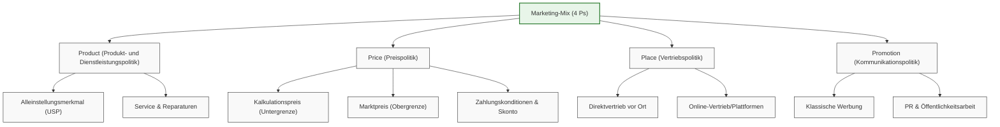

# Lernzusammenfassung Kapitel 5: Marketing und Markteintritt

Dieses Dokument bietet eine detaillierte Zusammenfassung von Kapitel 5 des Meisterkurses Teil 3 (Bayern).

## Der Marketing-Mix (Die 4 Ps)
Der Erfolg am Markt basiert auf der harmonischen Abstimmung von vier Kerninstrumenten:

## 5. Marketing und Markteintritt

Dieses Kapitel behandelt den Marketing-Mix und die Strategien für einen erfolgreichen Markteintritt des Handwerksunternehmens.

### Kompetenzen
- Den Marketing-Mix als Instrument der Unternehmensführung verstehen.
- Produkte und Dienstleistungen über Alleinstellungsmerkmale (USP) abgrenzen.
- Eine marktgerechte und betriebswirtschaftlich tragfähige Preispolitik entwickeln.

---
### Unterkapitel
- [[5_3_1_Marketing_Mix_Grundlagen|5.3.1 Marketing-Mix Grundlagen]]
- [[5_3_2_Produkt_Dienstleistungspolitik|5.3.2 Produkt- und Dienstleistungspolitik]]
- [[5_3_3_a_Preisbildung|5.3.3.a Preisbildung (Kalkulation vs. Markt)]]
- [[5_3_3_b_Konditionen_Zahlung|5.3.3.b Konditionen und Zahlungsbedingungen]]
- [[5_3_3_c_Preisstrategie_Politik|5.3.3.c Preisstrategie und Preispolitik]]
- [[5_3_4_Vertriebspolitik|5.3.4 Vertriebspolitik]]
- [[5_3_5_Werbung_Kommunikation|5.3.5 Werbung und Kommunikation]]

---

## 5.3.1 Marketing-Mix Grundlagen

Der Marketing-Mix ist das zentrale Steuerungsinstrument, um ein Unternehmen am Markt zu positionieren. Er besteht aus der optimalen Kombination verschiedener Bausteine.

### Die vier Bausteine (4 Ps)
1. **Produkt- bzw. Dienstleistungspolitik** (Product)
2. **Preispolitik** (Price)
3. **Vertriebspolitik** (Place)
4. **Werbung und Kommunikation** (Promotion)

### Zielsetzung
Für den Markterfolg ist es entscheidend, in diesen Bereichen **Alleinstellungsmerkmale (USPs)** zu entwickeln, diese klar herauszuarbeiten und dauerhaft zu sichern. Das Ziel ist die Unterscheidbarkeit vom Wettbewerb.

---

## 5.3.2 Produkt- und Dienstleistungspolitik

Im Zentrum steht die Frage: *Warum sollte der Kunde gerade mein Angebot wählen?* Da der **Grundnutzen** vieler Angebote vergleichbar ist, entscheidet der Zusatznutzen.

### Alleinstellungsmerkmale (USP)
Unterscheidungsmerkmale können vielfältig sein:
- **Design & Ästhetik:** Aussehen, Verpackung, Ausstattung.
- **Qualität & Technik:** Qualität, Bedienungsfreundlichkeit, Umweltorientierung.
- **Service & Vertrieb:** Lieferservice, Vor-Ort-Montage, Vertriebsweg.

### Erweiterter Leistungsbegriff
Moderne Handwerksbetriebe verkaufen oft kein isoliertes Produkt, sondern eine **vollständige Problemlösung**.
Wichtige Bestandteile sind hierbei:
- Umfassender Kundendienst.
- Reparaturleistungen.
- Entsorgungsleistungen.
- Verbraucherschutz.

---

## 5.3.3.a Preisbildung

Handwerksprodukte bewegen sich in der Regel nicht im Niedrigpreissegment, sondern in höheren Preisbereichen. Die Preisbildung ist ein Spannungsfeld zwischen interner Notwendigkeit und externer Durchsetzbarkeit.

### 1. Betrieblicher Kalkulationspreis (Untergrenze)
Der Preis muss aus betriebswirtschaftlicher Sicht:
- Alle entstehenden **Kosten decken**.
- Einen angemessenen **Unternehmerlohn** ermöglichen.

### 2. Marktpreis (Obergrenze)
Die Wettbewerbs- und Marktsituation bestimmt, was tatsächlich am Markt erzielt werden kann. Einflussfaktoren sind:
- **Nachfrage:** Einkommenssituation der Verbraucher, Sättigungsgrad des Marktes.
- **Wettbewerb:** Regionale Konkurrenz, ausländische Anbieter, Online-Handel.

**Grundsatz:** Langfristig muss der Marktpreis über dem betrieblich kalkulierten Preis liegen, um die Existenz des Betriebs zu sichern.

---

## 5.3.3.b Konditionen und Zahlungsbedingungen

Neben dem Grundpreis bestimmen die Konditionen (Liefer- und Zahlungsbedingungen) die Attraktivität des Angebots. Diese werden üblicherweise in den **Allgemeinen Geschäftsbedingungen (AGB)** geregelt.

### Lieferbedingungen
Regelungen zu:
- Lieferort und Lieferdatum.
- Umtausch- und Garantiebedingungen.
- Konsequenzen bei verspäteter Lieferung.

### Zahlungsbedingungen & Preisnachlässe
- **Zahlungsarten:** Barzahlung, Kartenzahlung, Überweisung, SEPA-Lastschrift, PayPal, mobiles Bezahlen.
- **Fristen:** Zahlungsziele, Vorauszahlungen.
- **Anreize:** Skontogewährung (bei schneller Zahlung), Mengenrabatte, Sonderaktionen.

---

## 5.3.3.c Preisstrategie und Preispolitik

Die Preispolitik nutzt strategische und psychologische Instrumente, um den Absatz zu fördern und den Markteintritt zu erleichtern.

### Preispolitische Instrumente
- **Psychologische Preisschwellen:** z.B. 19,99 € statt 20,00 €.
- **Finanzierungshilfen:** Teilzahlungsmodelle oder Finanzierungsangebote.
- **Einführungspreise:** Zeitlich begrenzt, um Bekanntheit zu steigern und Neukunden zu gewinnen (Vorsicht: Liquidität und Gewinn prüfen!).

### Strategische Grundsätze beim Markteintritt
Ein Betrieb muss einen ausgewogenen Kompromiss finden aus:
1. **Kostenorientierung** (Was muss ich verlangen?)
2. **Nachfrageorientierung** (Was will der Kunde zahlen?)
3. **Konkurrenzorientierung** (Was verlangen andere?)

**Wichtig:** Ein niedriger Preis allein ist selten das Hauptargument im Handwerk. Qualität, Service und besonderer Kundennutzen müssen den Preis rechtfertigen. Wirtschaftlich nicht vertretbare Niedrigpreise sind zu vermeiden.

---

## 5.3.4 Vertriebspolitik

Die Vertriebspolitik (auch Distributionspolitik genannt) regelt, wie die Produkte und Dienstleistungen eines Handwerksbetriebs den Weg zum Kunden finden.

### Vertriebsformen

Es werden drei grundlegende Vertriebsformen unterschieden:

#### 1. Direktvertrieb
- Der Betrieb verkauft seine Leistungen **unmittelbar** an den Endkunden.
- Vorteil: Volle Kontrolle über die Kundenbeziehung und keine Provisionszahlungen an Zwischenhändler.

#### 2. Indirekter Vertrieb
- Einschaltung von **Vermittlern oder Handelsunternehmen** (z. B. Einzelhandel, Großhandel).
- **Herausforderung:** Sowohl die Vermittler als auch die Endkunden müssen überzeugt werden.
- **Kosten:** Provisionen oder Vergütungen für die Vermittler müssen in die Kalkulation einfließen.

#### 3. Online-Vertrieb
- Vertrieb über das Internet (Webshop, Onlineshop, Verkaufsplattformen).
- Gilt oft als Sonderform des Direktvertriebs.
- **Digitale Geschäftsmodelle:**
	- Starke Vernetzung mit Kunden und Partnern.
	- Fokus auf Gesamtlösungen und Zusatzservices.
	- Kundenorientierte Gestaltung der Beziehung (Digital Customer Journey).
	- Nutzerfreundliche, digitale Zahlungsarten.

### Auswahlkriterien für Vertriebswege
Die Entscheidung für einen Vertriebsweg hängt von folgenden Faktoren ab:
- **Kundenerwartungen:** Wie und wo möchte die Zielgruppe kaufen?
- **Leistungsart:** Ist das Produkt/die Dienstleistung beratungsintensiv oder montagebedürftig?
- **Wirtschaftlichkeit:** Welche Vertriebs- und Versandkosten entstehen?

---

## 5.3.5 Werbung und Kommunikation

Die Kommunikationspolitik sorgt dafür, dass potenzielle Kunden von der Existenz und dem Nutzen des Angebots erfahren. Sie dient der Information und der gezielten Beeinflussung des Verbraucherverhaltens.

### Grundfragen der Kommunikation
Gründer müssen vorab klären:
- **Zielgruppe:** Welche Botschaften passen zu welcher Gruppe?
- **Botschaft:** Welche Stärken (Qualität, Zuverlässigkeit, Service) stehen im Fokus?
- **Medien:** Welche Kanäle erreicht die Zielgruppe am besten?
- **Budget:** Wie viel Kapital steht für Marketing zur Verfügung?

### A. Werbung
Werbung muss besonders in der Markteintrittsphase konsequent zielgruppen- und regionalorientiert sein.

#### Werbemittel (Beispiele)
- **Klassisch:** Anzeigen (Tageszeitung, regional), Flyer, Visitenkarten, Plakate, Schaufenster.
- **Direkt:** Werbebriefe, Mailings, Wurfsendungen.
- **Mobil/Vor Ort:** Fahrzeugbeschriftung, Firmenlogo (Wiedererkennungswert), Verkehrsmittelwerbung.
- **Digital:** Internetauftritt (Webseite), soziale Medien, Online-Dienste.

#### Rechtliche Anforderungen
Werbung muss **wahr und klar** sein. Wichtige Vorschriften:
- **UWG:** Gesetz gegen den unlauteren Wettbewerb.
- **Datenschutz:** DSGVO-konforme Nutzung von E-Mail-Adressen und Daten.
- **Internet-Pflichten:** Impressumspflicht und Datenschutzhinweise auf Webseiten.
*Warnung:* Verstöße können teure Abmahnungen zur Folge haben.

*Verweis:* Siehe auch [[Band_1_Index|Band 1, Abschnitt 6.4]] für rechtliche Details.

### B. Kommunikation und Öffentlichkeitsarbeit (PR)
PR dient dem Aufbau eines positiven Images in der Öffentlichkeit.

- **Medienarbeit:** Pflege von Kontakten zu Lokalpresse und Rundfunk. Pressemitteilungen zur Geschäftseröffnung sind besonders glaubwürdig.
- **Events:** Tag der offenen Tür, Eröffnungsfeier, Sonderaktionen.
- **Bekanntheit:** Sponsoring (Sportvereine), Newsletter, Teilnahme an Messen und Ausstellungen.

### Corporate Identity (CI)
Die CI ist die Gesamtheit der Merkmale, die ein Unternehmen kennzeichnen. Sie erfordert die Übereinstimmung von:
1. **Kommunikation** (Was wir sagen)
2. **Erscheinungsbild** (Wie wir aussehen - Corporate Design)
3. **Auftreten & Verhalten** (Wie wir handeln - Corporate Behavior)

Ein wesentlicher Teil der CI ist das **Unternehmensleitbild**.

---
*Siehe auch:* [[3_1_Marketing_Details|Band 3, Abschnitt 3.1 für vertiefendes Marketing]]

---
